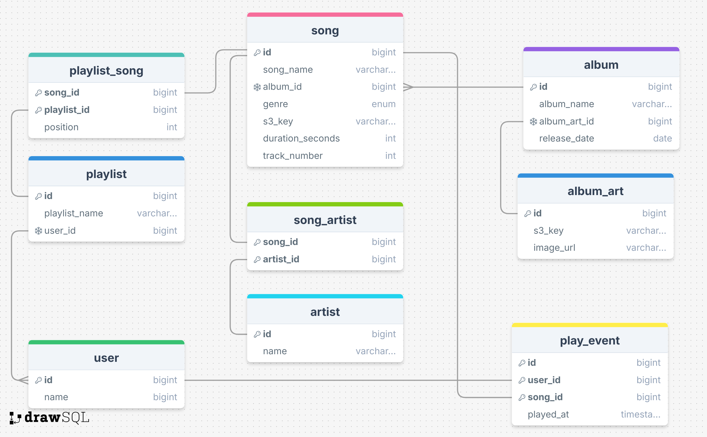

# CS 452: Natural Language SQL

## System Descripription: Generates natural language answers from natural language questions using SQLite database and OpenAI API. 

### Tech Stack:
I used Rust with tokio for async. I used sqlite for the db, and OpenAI API for NL processing. 

### Music Player DB:

My Database is for a music player application. Users can add songs and playlists, and keep track of what music they listen to. 



## Example Questions:

1. Who is the most popular artist on Tuesdays?
```
> Who is the most popular artist on Tuesdays
SQL: SELECT "artist"."name", COUNT(*) AS play_count
FROM "play_event"
JOIN "song" ON "play_event"."song_id" = "song"."id"
JOIN "song_artist" ON "song"."id" = "song_artist"."song_id"
JOIN "artist" ON "song_artist"."artist_id" = "artist"."id"
WHERE strftime('%w', "play_event"."played_at") = '2'
GROUP BY "artist"."id"
ORDER BY play_count DESC
LIMIT 1
→ The most popular artist on Tuesdays is Neon District, with 2 plays.
```

2. Which genre is the most popular?

```
> Which genre is the most popular?
SQL: SELECT "genre"."name", COUNT("play_event"."id") AS play_count
FROM "play_event"
JOIN "song" ON "play_event"."song_id" = "song"."id"
JOIN "genre" ON "song"."genre_id" = "genre"."id"
GROUP BY "genre"."name"
ORDER BY play_count DESC
LIMIT 1
→ The most popular genre is Electronic, with 16 plays.
```

3. Which artist or artists have created the most songs?

```
> Which artist or artists have created the most songs?
SQL: SELECT "artist"."name", COUNT("song"."id") AS song_count
FROM "artist"
JOIN "song_artist" ON "artist"."id" = "song_artist"."artist_id"
JOIN "song" ON "song_artist"."song_id" = "song"."id"
GROUP BY "artist"."name"
ORDER BY song_count DESC
LIMIT 100
→ The artists Sarah Blue and Ava Chen have created the most songs, each with 5 songs.

```

4. Which artist has created the most songs? (Only asking for 1)
```
> which artist has created the most songs?
SQL: SELECT "artist"."name", COUNT("song"."id") AS song_count
FROM "artist"
JOIN "song_artist" ON "artist"."id" = "song_artist"."artist_id"
JOIN "song" ON "song_artist"."song_id" = "song"."id"
GROUP BY "artist"."id"
ORDER BY song_count DESC
LIMIT 1
→ The artist who has created the most songs is Ava Chen, with a total of 5 songs.
```

5. Which genre has the longest song?

```
> Which genre has the longest song?
SQL: SELECT "genre"."name", MAX("song"."duration_seconds") AS "longest_duration"
FROM "song"
JOIN "genre" ON "song"."genre_id" = "genre"."id"
GROUP BY "genre"."name"
ORDER BY "longest_duration" DESC
LIMIT 1
→ The genre with the longest song is Rock, with a duration of 312 seconds.

```

6. Which user listens to the most Electronic music?

```
> Which user listens to the most Electronic music?
SQL: SELECT "user"."name", COUNT(*) AS play_count
FROM "play_event"
JOIN "user" ON "play_event"."user_id" = "user"."id"
JOIN "song" ON "play_event"."song_id" = "song"."id"
JOIN "genre" ON "song"."genre_id" = "genre"."id"
WHERE "genre"."name" = 'Electronic'
GROUP BY "user"."id"
ORDER BY play_count DESC
LIMIT 1
→ Alice Johnson listens to the most Electronic music, with a total of 5 plays.
```

7. Insert a new record for a song called Rock of Ages by the Tabernacle choir

```
> Insert a new record for a song called Rock of Ages by the Tabernacle choir
Safety: The generated SQL contains disallowed statements. Skipping.
```

## Prompting Strategies:

### System Prompt:
I used a system prompt for the roles of the nl to sql, and results to sql APIs. I used claude to create these system prompts, but they explain the roles of each of API's, the rules they follow, and the output they should provide. This is helpful for preventing markdown in the sql response so we just have the raw query. 

```rust

const NL_TO_SQL_SYSTEM: &str = r#"You are an expert SQLite query generator. You are given the full database schema and a user's natural language question. Your job is to produce a single valid SQLite SELECT query that answers the question.

Schema:
{schema}

Rules:
- Return ONLY the raw SQL query — no explanation, no markdown fences, no commentary
- Use only tables and columns that exist in the schema above
- Use proper JOIN syntax when combining tables
- Default to LIMIT 100 unless the user explicitly asks for all results
- Never generate DROP, DELETE, UPDATE, INSERT, ALTER, or any DDL/DML besides SELECT
- Use double-quoted identifiers for table/column names that are reserved words (e.g. "user")
- When the question is ambiguous, prefer the most common-sense interpretation"#;

```

```rust
const RESULTS_TO_NL_SYSTEM: &str = r#"You are a helpful assistant that summarizes database query results in plain English.

You will be given:
1. The database schema for context on what the data represents
2. The user's original question
3. The SQL query that was generated
4. The query results as JSON

Your job is to answer the user's question in one or two concise, natural sentences based on the results. Be direct and specific — include relevant numbers, names, and details from the results. If the results are empty, say so clearly."#;

```

### Query Generation:

```rust
pub async fn nl_to_sql(schema: &str, question: &str) -> Result<String,Box<dyn std::error::Error>>
```

I pass the schema and question to the API. The schema provides most of the required context for generating the query. This is all the unique informatio we have at this point in the result generation. 


### Result Analysis:

```rust
pub async fn results_to_nl(
    schema: &str,
    question: &str,
    sql: &str,
    results: &str,
) -> Result<String, Box<dyn std::error::Error>>
```

I pass the schema, question, sql query, and returned result to the API. I provide the schema and sql query to give the API more context on the entire system. It's really important to provide the original question, because I found the LLM does a good job at reframing the response with the question. 